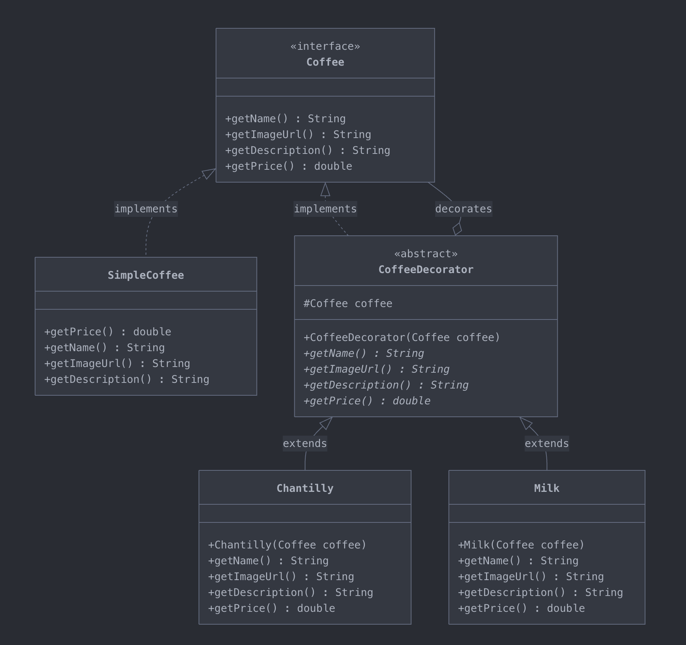

# Coffee Shop - Exercício de Design Pattern Decorator

## Sobre o Projeto

Este é um projeto educacional desenvolvido para praticar o **Design Pattern Decorator** em Java, utilizando Spring Boot e Vaadin para a interface gráfica.

## Objetivo

O objetivo deste exercício é implementar um sistema de cafeteria onde os usuários podem adicionar complementos (decoradores) a um café básico, aplicando o padrão de projeto Decorator de forma prática.

<video width="100%" controls>
  <source src="docs/video.mp4" type="video/mp4">
  Seu navegador não suporta a tag de vídeo.
</video>

## O que é o Pattern Decorator?

O **Decorator** é um padrão de projeto estrutural que permite adicionar novos comportamentos a objetos dinamicamente, colocando-os dentro de objetos especiais (wrappers) que contêm esses comportamentos.

### Como Funciona

1. **Componente Base**: `SimpleCoffee` - Um café simples com nome, descrição, imagem e preço
2. **Decoradores**: Classes que "envolvem" o café base e adicionam funcionalidades extras:
   - `Milk` - Adiciona leite ao café (+R$ 1,00)
   - `Chantilly` - Adiciona chantilly ao café (+R$ 2,99)
   - Outros decoradores podem ser criados

### Fluxo de Execução

Quando um cliente monta seu pedido, o padrão Decorator funciona assim:

**Exemplo prático:**
```java
// 1. Cliente começa com um café simples
Coffee meuCafe = new SimpleCoffee("coffee", "Café Expresso", "Café forte", 5.00);

// 2. Adiciona leite (decora o café)
meuCafe = new Milk(meuCafe);
// Agora: descrição = "Café forte, leite"
//       preço = 5.00 + 1.00 = 6.00

// 3. Adiciona chantilly (decora novamente)
meuCafe = new Chantilly(meuCafe);
// Agora: descrição = "Café forte, leite, chantilly"
//       preço = 6.00 + 2.99 = 8.99
```


Quando `meuCafe.getPrice()` é chamado:
1. `Chantilly.getPrice()` → chama `coffee.getPrice()` + 2.99
2. `Milk.getPrice()` → chama `coffee.getPrice()` + 1.00
3. `SimpleCoffee.getPrice()` → retorna 5.00
4. Resultado final: 5.00 + 1.00 + 2.99 = **R$ 8.99**

### Estrutura do Pattern

**Diagrama UML:**



> **Nota:** O diagrama mostra a estrutura completa do padrão Decorator aplicado ao projeto Coffee Shop.

## Atividade

### Tarefa Principal

**Implementar o Design Pattern Decorator do zero** seguindo a estrutura abaixo.

### Passo 1: Criar a Interface Base `Coffee`

No pacote `model`, crie a interface `Coffee.java`.


### Passo 2: Criar a Classe Concreta `SimpleCoffee`

Crie a classe `SimpleCoffee.java` que implementa `Coffee`.

```java

public class SimpleCoffee implements Coffee {
    @Override
    public double getPrice() {
        return 9.99;
    }

    @Override
    public String getName() {
        return "Café Simples";
    }

    @Override
    public String getImageUrl() {
        return "coffee";
    }

    @Override
    public String getDescription() {
        return "Delicioso café expresso";
    }
}
```

### Passo 3: Criar a Classe Abstrata `CoffeeDecorator`

Crie a classe abstrata `CoffeeDecorator.java`

**O que fazer:**
- Crie o construtor que recebe um objeto `Coffee` que será decorado
- Crie os abstratos que serão implementados pelos decoradores concretos

### Passo 4: Criar Decoradores Concretos

Crie os decoradores concretos

#### Comportamento dos métodos:
- `getName()`: Se não houver um café decorado, retorna o nome do decorador. Caso contrário, retorna o nome do café decorado + ", com" + nome do decorator.
- `getDescription()`: Se não houver um café decorado, retorna a descrição do decorador. Caso contrário, retorna a descrição do café decorado + ", " + descrição do decorador.
- `getPrice()`: Se não houver um café decorado, retorna o preço do decorador. Caso contrário, retorna o preço do café decorado + preço do decorador.
- `getImageUrl()`: Se não houver um café decorado, retorna a imagem do decorador. Caso contrário, retorna o nome da imagem do café decorado + "-" + nome da imagem do decorator.

**Importante:** Não use a extensão `.png` no nome da imagem, ela será adicionada automaticamente.

### Passo 5: Implementar o Método `getOrder()` do `OrderService`

Este é o ponto crucial onde o padrão Decorator é aplicado! No `OrderService.java`, implemente o método `getOrder()`:

```java
public Coffee getOrder() {
    // TODO: Implementar a lógica do Decorator
    // 1. se a lista de pedidos estiver vazia, retornar um placeholder
    
    // 2. Instanciar o café base
    
    // 3. Aplicar cada decorador sobre o café
    // Percorra a lista de itens do pedido e para cada decorador, "envolva" o café atual
    // Exemplo: 
    if (item instanceof Milk) coffee = new Milk(coffee);

    // 4. Retornar o café decorado
}
```

**Como funciona:**
1. Se a lista de pedidos está vazia, retorna um placeholder
2. Cria o café base (`SimpleCoffee`) 
3. Para cada item no pedido, se for um decorador, "envolve" o café atual
4. Cada decorador adiciona sua funcionalidade (descrição, preço, etc) ao café
5. Retorna o café completamente decorado com todos os complementos

**Exemplo de uso:**
- Cliente escolhe: Café + Leite + Chantilly
- Resultado: `new Chantilly(new Milk(new SimpleCoffee(...)))`
- Descrição: "Café expresso, leite, chantilly"
- Preço: 5.00 + 1.00 + 2.99 = R$ 8.99

## 💡 Conceitos Importantes

### Vantagens do Pattern Decorator

1. ✅ **Flexibilidade**: Adicione funcionalidades dinamicamente
2. ✅ **Reutilização**: Combine decoradores de diferentes formas
3. ✅ **Open/Closed Principle**: Aberto para extensão, fechado para modificação
4. ✅ **Single Responsibility**: Cada decorador tem uma responsabilidade única


### Diagrama da Composição

Quando você cria `new Chantilly(new Milk(new SimpleCoffee(...)))`:

```
┌─────────────────────────────────────┐
│         Chantilly                   │
│  ┌──────────────────────────────┐   │
│  │        Milk                  │   │
│  │  ┌────────────────────────┐  │   │
│  │  │   SimpleCoffee         │  │   │
│  │  │  - name: "Café"        │  │   │
│  │  │  - price: 5.00         │  │   │
│  │  └────────────────────────┘  │   │
│  │  + adiciona leite (+1.00)    │   │
│  └──────────────────────────────┘   │
│  + adiciona chantilly (+2.99)       │
└─────────────────────────────────────┘
   Total: 5.00 + 1.00 + 2.99 = 8.99
```
