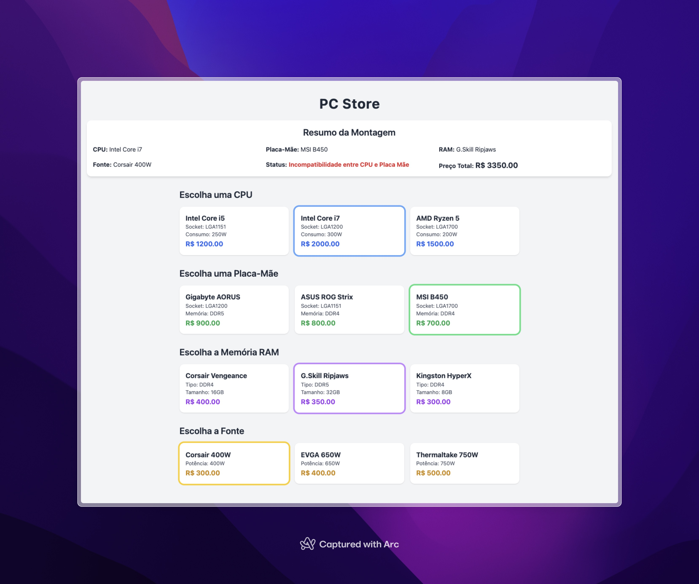

# Exercício: Store

## Objetivo
O objetivo deste exercício é ensinar os conceitos de **composição** e **herança** em Java, aplicando-os na criação de um sistema para montar um computador. Os alunos deverão criar os modelos necessários para representar os componentes de um computador e implementar as relações entre eles.

---

## Descrição do Sistema
O sistema permite que o usuário monte um computador selecionando os seguintes componentes:
- **CPU**
- **Placa-Mãe**
- **Memória RAM**
- **Fonte de Alimentação**

Cada componente possui atributos específicos e deve ser representado como uma classe. Além disso, todos os componentes compartilham atributos comuns, que serão definidos em uma classe base chamada `Componente`.

---

## Requisitos do Exercício

### 1. Criar a Classe Base `Componente`
- A classe `Componente` será **abstrata** e conterá os seguintes atributos:
  - `Long id`: Identificador único do componente.
  - `String nome`: Nome do componente.
  - `int consumo`: Consumo de energia em watts.
  - `double preco`: Preço do componente.
- Adicione os métodos `getters` e `setters` para os atributos.

### 2. Criar as Classes Específicas
Implemente as seguintes classes que herdam de `Componente`:

#### **CPU**
- Atributo adicional:
  - `Socket socket`: Tipo de socket da CPU (enum).
- Construtor: Deve inicializar todos os atributos, incluindo os da classe base.

#### **Placa-Mãe**
- Atributos adicionais:
  - `Socket socket`: Tipo de socket suportado pela placa-mãe.
  - `TipoMemoria tipoMemoria`: Tipo de memória suportado (enum).
- Métodos:
  - `boolean compativel(Cpu cpu)`: Verifica se a CPU é compatível com a placa-mãe.
  - `boolean compativel(Ram ram)`: Verifica se a RAM é compatível com a placa-mãe.

#### **RAM**
- Atributos adicionais:
  - `TipoMemoria tipo`: Tipo de memória (enum).
  - `int tamanhoGb`: Tamanho da memória em GB.
- Construtor: Deve inicializar todos os atributos, incluindo os da classe base.

#### **Fonte**
- Atributo adicional:
  - `int potencia`: Potência da fonte em watts.
- Construtor: Deve inicializar todos os atributos, incluindo os da classe base.

### 3. Criar os Enums
Implemente os seguintes enums para representar os tipos de socket e memória:
- **Socket**:
  - `LGA1151`
  - `LGA1200`
  - `LGA1700`
- **TipoMemoria**:
  - `DDR4`
  - `DDR5`

### 4. Criar a Classe `Computador`
- Atributos:
  - `PlacaMae placaMae`
  - `Cpu cpu`
  - `Ram ram`
  - `Fonte fonte`
- Métodos:
  - `String status()`: Retorna o status do computador:
    - "Computador incompleto" se algum componente estiver faltando.
    - "Incompatibilidade entre CPU e Placa Mãe" se a CPU não for compatível.
    - "Incompatibilidade entre RAM e Placa Mãe" se a RAM não for compatível.
    - "Fonte insuficiente para o sistema" se a potência total dos componentes for maior que a potência da fonte.
    - "Computador completo e funcionando" se tudo estiver correto.
  - `double precoTotal()`: Calcula o preço total dos componentes.

---

## Critérios de Avaliação
1. **Compreensão de Herança**: A classe `Componente` foi corretamente implementada como base para os outros componentes?
2. **Uso de Composição**: A classe `Computador` utiliza composição para representar os componentes?
3. **Enums**: Os enums `Socket` e `TipoMemoria` foram utilizados corretamente?
4. **Validação de Compatibilidade**: Os métodos de validação (`compativel`) estão funcionando corretamente?
5. **Interface do Usuário**: A página exibe corretamente os componentes, o preço total e o status do computador?

Boa sorte! 🚀