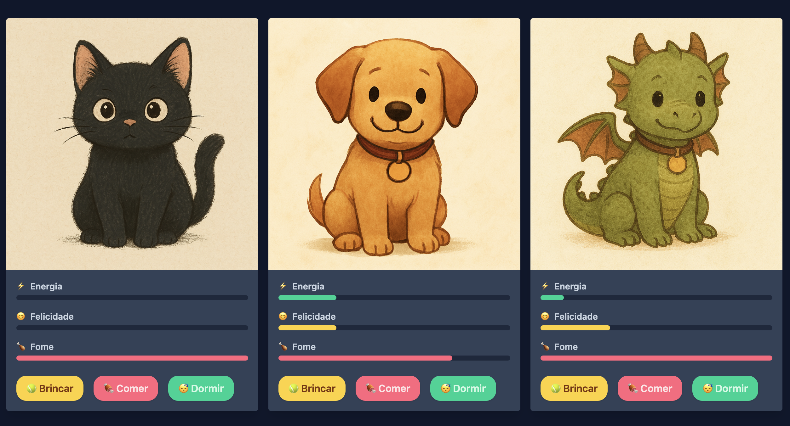

# 🐾 Missão - Tamagotchi 

Neste exercício, você vai criar um mini-jogo estilo Tamagotchi, onde o usuário pode interagir com diferentes bichinhos virtuais.

O foco do exercício é praticar os conceitos de:

- ✅ Classe abstrata
- ✅ Herança
- ✅ Sobrescrita de métodos (`@Override`)
- ✅ Organização de código orientado a objetos

---

## 🎯 Objetivo

Você deve modelar um sistema em Java onde diferentes **animais virtuais** (Gato, Cachorro e Dragão) possuem comportamentos distintos quando realizam as ações:

- **Brincar**
- **Comer**
- **Dormir**
- **Turno** (passagem do tempo)

---

## 🧩 Estrutura do projeto

Crie as seguintes classes dentro do pacote `model`:

### 📁 `model/Animal.java` (classe abstrata)

Esta classe deve conter:

- Atributos comuns:
  - `energia`
  - `fome`
  - `felicidade`
- Métodos `gets()`
- Métodos abstratos:
  - `brincar()`
  - `comer()`
  - `dormir()`
  - `turno()`

---

### 🐱 `model/Gato.java`
### 🐶 `model/Cachorro.java`
### 🐲 `model/Dragao.java`

Todas devem estender `Animal` e implementar os métodos com **comportamentos próprios**. Veja abaixo as regras específicas de cada uma.

---

## 📋 Regras de comportamento por animal

| Ação     | Gato 🐱                       | Cachorro 🐶                     | Dragão 🐲                             |
|----------|-------------------------------|----------------------------------|----------------------------------------|
| Brincar  | +10 felicidade, -5 energia, +5 fome  | +15 felicidade, -10 energia, +10 fome | +12 felicidade, -15 energia, +15 fome   |
| Comer    | -15 fome, +10 energia         | -20 fome, +15 energia           | -30 fome, +20 energia                 |
| Dormir   | +20 energia, +5 fome          | +15 energia, +10 fome           | +10 energia, +10 fome                 |
| Turno    | -5 energia, +5 fome, -3 felicidade | -10 energia, +10 fome, -5 felicidade | -15 energia, +10 fome, -7 felicidade    |

---

## 🎓 Justificativas

Essas diferenças refletem o **perfil comportamental de cada animal**:

- **Gato**: animal mais calmo, brinca moderadamente e dorme bastante. Gasta menos energia e tem fome controlada.
- **Cachorro**: agitado, sociável e ativo. Brinca intensamente, se alimenta bem e precisa de mais cuidado com energia.
- **Dragão**: criatura mágica e poderosa. Suas ações são intensas, exigem mais energia e comida. É exigente e precisa de atenção constante.

---

## ✅ Regras gerais dos atributos

- Todos os atributos devem variar de **0 a 100**.

---

Bom código! 🚀